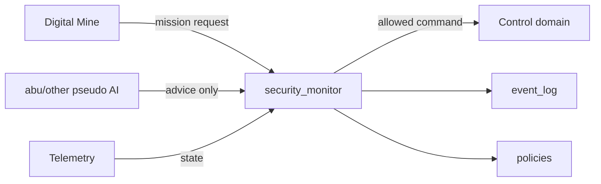

# Solution Report

## Architecture

The solution creates a separated ABU implementation under `src_solution/`.
Trusted code is placed in `src_solution/abu/tcb`; non-trusted advisory logic is
placed in `src_solution/abu/other`.



The TCB contains only deterministic standard-library code:
`event_log.py`, `policies.py`, `domains.py`, and `security_monitor.py`.
`numpy` is intentionally isolated in `src_solution/abu/other/pseudo_ai.py` and
appears only in `src_solution/sbom/SBOM_OTHER.cdx.json`.

## Policies And Domains

The security monitor is the only allowed mediator for inter-domain requests and
responses. `DomainMessage` records source, target, action, and payload.
`ALLOWED_FLOWS` permits Digital Mine to TCB requests, TCB to Control commands,
Telemetry or advisory AI to TCB inputs, and TCB responses back to the Digital
Mine. A direct `AI_OTHER -> CONTROL` request is denied.

Mission policy checks certificate presence, emergency stop state, drilling depth,
and azimuth bounds. Every accepted or denied mission is written to `event_log`.

## Security Tests

Security tests are documented in `docs/security_tests.md` and implemented in:

- `tests/security/test_solution_policies.py`
- `tests/security/test_solution_security_monitor.py`
- `tests/test_solution_event_log.py`
- `tests/test_solution_tcb_policy.py`

These tests import `src_solution`, exercise `event_log`, and cover the TCB
modules used for policy decisions and monitor-mediated requests.

## Certification And SBOM

The solution includes separate CycloneDX files:

- `src_solution/sbom/SBOM_TCB.cdx.json`
- `src_solution/sbom/SBOM_OTHER.cdx.json`

The TCB SBOM contains only `python-stdlib`. `numpy` and optional API-level
dependencies are placed in the OTHER SBOM, matching the TCB split and reducing
certification cost for trusted code.

Reproducible commands:

```bash
make install
make tests-all
pipenv run pytest -q tests/security tests/test_solution_event_log.py tests/test_solution_tcb_policy.py --cov=src_solution.abu.tcb
make prepare-cert-bundle
make certify-abu
make evaluate-score
```

## Evaluation Notes

The expected automatic evidence for C01-C19 is: solution package under
`src_solution/`, event log module, dependency manifest, separated SBOM files,
security tests with `pytest.mark.security`, tests importing `src_solution`, and
TCB coverage from the repository evaluation command. C20-C22 remain jury-scored:
the architecture keeps the trusted code small and gives a clear policy-to-test
trace.

